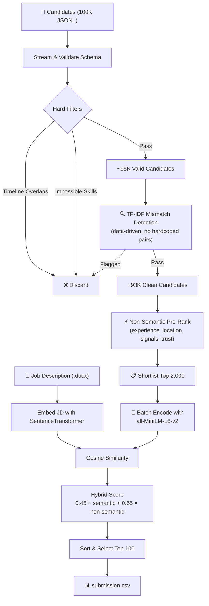

# Intelligent Candidate Discovery & Ranking System

An AI-powered candidate ranking pipeline that scores and ranks **100,000 synthetic candidate profiles** against a job description for an **AI/ML Engineer** role. Built for the Redrob Hackathon — runs fully offline on CPU within 5 minutes.

## Pipeline Flow



## Scoring Breakdown

| Dimension | Weight | Source |
|---|---|---|
| **Semantic similarity** | 45% | Cosine similarity between JD and candidate embeddings |
| **Non-semantic score** | 55% | Weighted composite of 5 sub-scores (see below) |

### Non-Semantic Sub-Scores

| Sub-Score | Weight | Logic |
|---|---|---|
| Experience | 15% | Gaussian curve peaking at 7 years (std=3.5) |
| Notice period | 10% | Linear decay: 30d → 1.0, 180d → 0.0 |
| Location | 10% | Tier-1 Indian hubs preferred, floor 0.35 |
| Platform signals | 45% | 7 behavioral signals (GitHub, response rate, assessments, etc.) |
| Trust signals | 20% | Email/phone verification, LinkedIn, endorsements |

## Project Structure

```
candidate_ranker/
├── rank.py                  # CLI entry-point, orchestrates the full pipeline
├── pyproject.toml           # Poetry dependencies
├── requirements.txt         # Pip-compatible dependency list
├── src/
│   ├── __init__.py
│   ├── data_loader.py       # JSONL streaming + .docx parsing
│   ├── embeddings.py        # SentenceTransformer wrapper (all-MiniLM-L6-v2)
│   ├── heuristics.py        # Hard filters, TF-IDF mismatch detector, soft penalties
│   ├── schema_validator.py  # Structural validation of candidate records
│   └── scoring.py           # Non-semantic sub-score calculations
└── submission.csv           # Output (generated after running)
```

## Installation

### Prerequisites

- **Python 3.12+**
- **Poetry** (Python package manager)

### Steps

```bash
# 1. Clone the repository
git clone <repo-url>
cd Job-Candidate-Ranking-System/candidate_ranker

# 2. Set up the Python environment with Poetry
poetry env use 3.12
poetry lock
poetry install

# 3. Verify all dependencies are installed
poetry run python -c "import sentence_transformers; import pandas; import numpy; import jsonlines; import docx; print('All dependencies OK')"
```

### Installed Packages

| Package | Version | Purpose |
|---|---|---|
| `sentence-transformers` | ^3.0.0 | Semantic embeddings (all-MiniLM-L6-v2) |
| `torch` | ^2.5.0 | ML backend for sentence-transformers |
| `pandas` | ^2.0.0 | Data manipulation |
| `numpy` | ^2.0.0 | Numerical computation |
| `jsonlines` | ^4.0.0 | JSONL file streaming |
| `python-docx` | ^1.0.0 | Parsing .docx job description |

> **Note:** `scikit-learn` is automatically installed as a dependency of `sentence-transformers` and is used for TF-IDF mismatch detection.

## Execution

```bash
poetry run python rank.py \
    --candidates path/to/candidates.jsonl \
    --jd path/to/job_description.docx \
    --out submission.csv
```

### Example (with hackathon dataset)

```bash
poetry run python rank.py \
    --candidates "../[PUB] India_runs_data_and_ai_challenge/India_runs_data_and_ai_challenge/candidates.jsonl" \
    --jd "../[PUB] India_runs_data_and_ai_challenge/India_runs_data_and_ai_challenge/job_description.docx" \
    --out submission.csv
```

### Output

The script produces `submission.csv` with exactly 100 rows:

| Column | Description |
|---|---|
| `candidate_id` | e.g., `CAND_0012345` |
| `rank` | 1–100 (1 = best fit) |
| `score` | Hybrid score (0.0–1.0) |
| `reasoning` | 1–2 sentence justification grounded in profile data |

### Validate Submission

```bash
poetry run python "../[PUB] India_runs_data_and_ai_challenge/India_runs_data_and_ai_challenge/validate_submission.py" submission.csv
```

## Compute Constraints

| Constraint | Limit | Status |
|---|---|---|
| Runtime | ≤ 5 min wall-clock | ✅ ~85s with two-stage funnel |
| RAM | ≤ 16 GB | ✅ Streaming + shortlist keeps memory low |
| Compute | CPU only | ✅ No GPU required |
| Network | Offline | ✅ Model cached locally after first download |

## Key Optimizations

1. **Two-stage funnel** — Pre-rank 95K candidates by non-semantic score (instant), then only embed the top 2,000
2. **Batch encoding** — `batch_size=128` for better CPU throughput
3. **Text truncation** — Cap candidate text to 500 chars for faster encoding
4. **Vectorized scoring** — Numpy batch cosine similarity instead of per-candidate loops
5. **Data-driven mismatch detection** — TF-IDF coherence analysis replaces hardcoded keyword pairs

## Sandbox / Interactive Web UI

The system includes an interactive Web Application (FastAPI backend + Vanilla HTML/CSS/JS frontend) serving as a sandbox environment to test and run the ranking pipeline end-to-end. It features:
- Manual file uploaders for custom Job Descriptions (.docx, .txt) and Candidate Datasets (.jsonl, .jsonl.gz, .json).
- Real-time step-by-step progress logging of the active execution stages using Server-Sent Events.
- Funnel metrics reporting (Input count, Heuristics/schema filters, Domain mismatches, and Final ranked).
- Interactive Top Ranked Candidates preview table.
- Downloadable `submission.csv` containing the ranked list matching the challenge spec.
- Dynamic cross-verification Candidate Details Inspector (renders clean profile JSON upon row click).

### Running the Web UI locally
To run the web app locally using Poetry:
```bash
poetry run python app.py
```
Once started, access the Web UI in your browser at: `http://localhost:8501`

### Running with Docker Sandbox
A self-contained Dockerfile is provided to satisfy the sandbox/demo run requirement. It pre-caches all required Hugging Face model weights (`all-MiniLM-L6-v2` and `google/flan-t5-base`) during the image build phase to guarantee 100% offline functionality.

#### 1. Build the Docker Image
```bash
docker build -t candidate-ranker-sandbox .
```

#### 2. Run the Container
```bash
docker run -p 8501:8501 candidate-ranker-sandbox
```
Once started, access the Web UI in your browser at: `http://localhost:8501`

#### 3. Compose (Alternative)
Alternatively, you can spin up the service using docker-compose:
```bash
docker compose up --build
```


